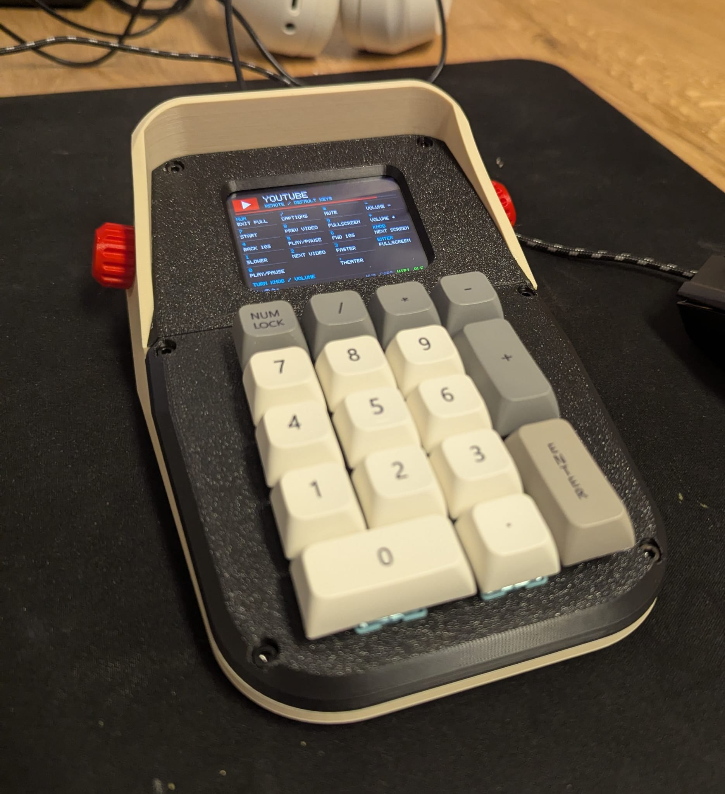
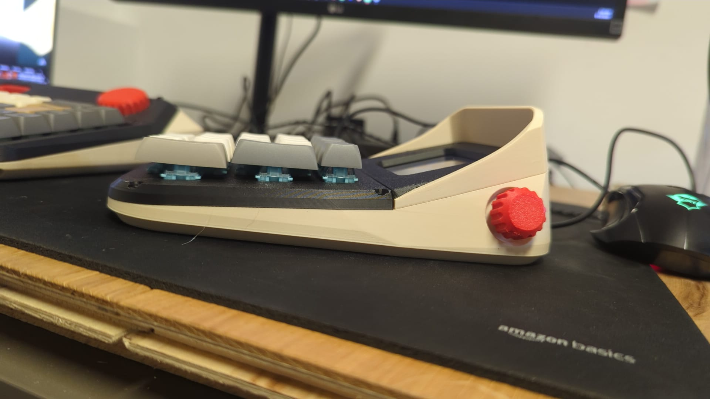
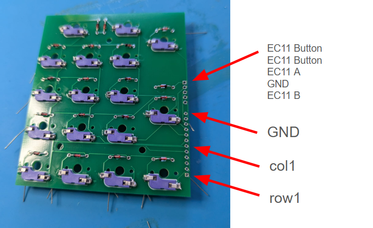
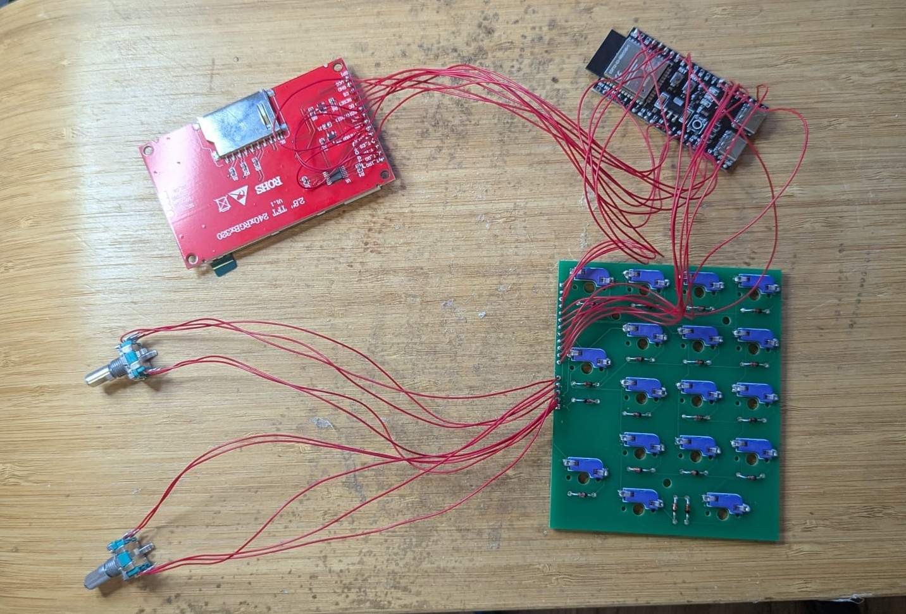

# Macro Pad 



This is a number pad that also works as a macro pad. You can assign a different function to each key and save up to five different configurations.

I adjusted the overall dimensions and repositioned the knob to give it better proportions. I really like its size. It is quite chunky and has a strong presence on the desk. Since a number pad is usually idle most of the time, the screen displays a clock when it is not being used.

The screen can also play GIFs or turn the device into a standalone calculator. It connects to a PC or phone via Bluetooth Low Energy (BLE).

It solves several problems for me. I can type numbers much more comfortably, and most importantly, I can control movie playback from a distance, including playing and pausing, without having to reach for the keyboard.

It is a small device, but it has brought a noticeable improvement to my quality of life.

The STL files and firmware are available in this repository

Un Kyu Lee



## Default screens

Press the knob to cycle through **Numpad → YouTube → Calculator → device info**.
Slots 4 and 5 are disabled until you enable them in the web interface. Turning the knob adjusts
the host volume on every screen.

1. **Numpad:** standard numeric keypad bindings, with the clock on the display.
2. **YouTube:** remote bindings and an animated red play button, with a
   keypad guide baked into the GIF showing the default actions. These labels
   are part of the image and do not change when you edit key bindings. Upload
   `src/data/gif/youtube.gif` through the web interface and select it for this
   screen. The default file path is `/gif/youtube.gif`; the firmware contains
   no embedded YouTube image. If the screen previously used the built-in GIF,
   select the uploaded file in its settings and save.
3. **Calculator:** standalone arithmetic using the printed digits and operators.
   Enter evaluates, Num Lock clears, and the decimal key enters a decimal point.

YouTube bindings (labels refer to the physical keycaps):

| Key | Action |
| --- | --- |
| `0` | Play/pause using Space |
| `4` / `6` | Rewind / forward 10 seconds |
| `8` / `2` | Previous / next video |
| `5` | Play/pause using K |
| `7` | Seek to the beginning |
| `9` or Enter | Toggle fullscreen |
| `1` / `3` | Slower / faster playback |
| `/` | Toggle captions |
| `*` | Toggle mute |
| `-` / `+` | Lower / raise player volume |
| `.` | Toggle theater mode |
| Num Lock | Exit fullscreen |

Click the YouTube player first so it receives the shortcuts. Previous video
(`Shift+P`) works within a playlist; next video (`Shift+N`) also works with
suggested videos. These bindings target the desktop web player; see
[YouTube's keyboard shortcuts](https://support.google.com/youtube/answer/7631406?hl=en).

Existing `/config.json` settings are preserved when updating the firmware. To
apply these factory defaults to an already configured device, use **Reset to
defaults** in the web interface after updating. This also resets saved Wi-Fi
networks and other custom settings, so save anything you want to keep first.
Alternatively, edit the three screen slots manually to preserve other settings.

The bundled GIF source is `src/scripts/generate_youtube_gif.py`; running it with
Python regenerates `src/data/gif/youtube.gif` for upload.

# Bill of Material

* [ILI9341 2.8" TFT LCD (240x320)](https://ko.aliexpress.com/item/1005006323532762.html)
  – Includes a built-in SD card slot (used in this build). Variations exist, so double-check dimensions if using the provided STL files.
  - If you can find the same dimension with ST7789 chip, it will still work and actually has a better quality. Just that it is a bit difficult to find than ILI9341

* [ESP32-S3 N16R8](https://www.amazon.com/Development-AYWHP-ESP32-S3-DevKitC-WROOM-1-N16R8-Compatible/dp/B0DG8L7MQ9)

* [Keypad PCB](./PCB)
  - You will need a PCB for the keypad. It is possible to handwire instead of using the PCB. Refer to the schematic to figure out the wiring in case of hand wiring


# Wiring Diagram


## ESP32-S3 and DISPLAY

The panel is two separate chips on one board: the **ILI9341** display controller and the
**XPT2046** resistive touch digitiser. They share a single SPI bus (SPI3 / HSPI) and are
told apart by their own chip selects — `TFT_CS` for the panel, `TOUCH_CS` for touch.
Eleven wires total, one of which is optional.

```
   ESP32-S3                              ILI9341 module
   ========                              ==============

   3V3      ───────────────────────────  VCC
   GND      ───────────────────────────  GND

   GPIO 12  ──┬────────────────────────  SCK     ┐
              └────────────────────────  T_CLK   │
   GPIO 11  ──┬────────────────────────  SDI     │  shared
              └────────────────────────  T_DIN   │  SPI bus
   GPIO 13  ──┬────────────────────────  SDO     │
              └────────────────────────  T_DO    ┘

   GPIO 10  ───────────────────────────  CS      ─  display select
   GPIO  3  ───────────────────────────  RESET
   GPIO 46  ───────────────────────────  DC / RS
   GPIO 14  ───────────────────────────  LED     ─  backlight

   GPIO  9  ───────────────────────────  T_CS    ─  touch select
```

## Display and touch

| ESP32-S3 | Module pin    | Signal             | Notes |
| -------- | ------------- | ------------------ | ----- |
| `3V3`    | `VCC`         | 3.3 V supply       | Panel and both controllers are 3.3 V logic |
| `GND`    | `GND`         | Ground             | Keep the return short, next to the SPI lines |
| `GPIO 12`| `SCK` `T_CLK` | SPI clock — shared | One clock, both chips |
| `GPIO 11`| `SDI` `T_DIN` | MOSI — shared      | `SDI` on the panel, `T_DIN` on the digitiser |
| `GPIO 13`| `SDO` `T_DO`  | MISO — shared      | **Required.** Touch is read-back only; no MISO, no coordinates |
| `GPIO 10`| `CS`          | Display select     | `TFT_CS` |
| `GPIO  3`| `RESET`       | Panel reset        | Strapping pin (JTAG source); safe as an output |
| `GPIO 46`| `DC` / `RS`   | Data / command     | Strapping pin; floats during reset, output after boot |
| `GPIO 14`| `LED`         | Backlight          | Module carries the series resistor; PWM here for brightness |
| `GPIO  9`| `T_CS`        | Touch select       | `TOUCH_CS` |
| `GPIO  8`| `T_IRQ`       | Pen interrupt      | Optional — TFT_eSPI polls instead. Wire it only for wake-on-touch |

The module's **SD card header is left unconnected**. Firmware storage is the internal
`storage` FAT partition (`FFat`), exposed to the host over USB MSC.


## ESP32-S3 and KEYPAD

A scanned 5 × 4 matrix. Nine GPIO carry 18 keys — 17 Cherry MX switches (`U1`–`U17`) plus
the knob's push button — each with a 1N4148 (`D1`–`D18`) so held keys can't ghost. Rows are
driven, columns are read; the knob's A/B ride the same ribbon.

```
   ESP32-S3                            CN2          Keypad PCB
   ========                         (12-pin)        ==========

   GPIO  1  ──────────────────────────  1  ───────── ROW 1   ┐
   GPIO  2  ──────────────────────────  2  ───────── ROW 2   │
   GPIO 42  ──────────────────────────  3  ───────── ROW 3   │  driven
   GPIO 41  ──────────────────────────  4  ───────── ROW 4   │
   GPIO 40  ──────────────────────────  5  ───────── ROW 5   ┘

   GPIO 39  ──────────────────────────  6  ───────── COL 1   ┐
   GPIO 17  ──────────────────────────  7  ───────── COL 2   │  read
   GPIO 18  ──────────────────────────  8  ───────── COL 3   │  (pull-up)
   GPIO 47  ──────────────────────────  9  ───────── COL 4   ┘

   GPIO  4  ────────────────────────── 10  ───────── KNOB A
   GPIO  5  ────────────────────────── 11  ───────── KNOB B
   GND      ────────────────────────── 12  ───────── GND


   one node:   ROW n ──┬── switch ──▶|── COL m
                       │     Uxx      Dxx
```

[PCB Schematic](./PCB/Schematic.pdf)


### Physical layout






